<!-- SUBRATA — DIGITAL UNIVERSE  ·  edit values in config/profile.yml then mirror here -->

<picture>
  <source media="(prefers-color-scheme: light)" srcset="./assets/hero/hero-light.svg" />
  
</picture>

 

 

  

<picture>
  <source media="(prefers-color-scheme: light)" srcset="./assets/cards/profile-card-light.svg" />
  
</picture>

  

  

I build immersive web experiences, practice DSA with Java, explore DevOps and cloud technologies, and experiment with 3D interfaces using Three.js and React Three Fiber.

  

  

  

  
   
  <picture>
    <source media="(prefers-color-scheme: light)" srcset="https://skillicons.dev/icons?i=java,js,py,c,react,nextjs,tailwind,threejs,nodejs,express&theme=light" />
    
  </picture>
    
  <picture>
    <source media="(prefers-color-scheme: light)" srcset="https://skillicons.dev/icons?i=mongodb,mysql,git,githubactions,docker,linux,aws,vscode,figma,postman&theme=light" />
    
  </picture>

  

  

 

  <picture>
    <source media="(prefers-color-scheme: light)" srcset="https://streak-stats.demolab.com?user=subrata-code&hide_border=true&background=e8f0ff&stroke=93c5fd&ring=3b82f6&fire=7c3aed&currStreakLabel=1d4ed8&sideLabels=334155&currStreakNum=0f172a&sideNums=334155&dates=64748b" />
    
  </picture>

 

  

  
   
  <a href="https://leetcode.com/u/subrata2005/">
    <picture>
      <source media="(prefers-color-scheme: light)" srcset="https://leetcard.jacoblin.cool/subrata2005?theme=light&font=Fira%20Code&ext=heatmap&border=0&radius=16" />
      
    </picture>
  </a>

  

**Projects orbit**

<table>
  <tr>
    <td width="50%">
      <a href="https://github.com/subrata-code/Rivo">
        
      </a>
    </td>
    <td width="50%">
      <a href="https://github.com/subrata-code/subrata-s-portfolio">
        
      </a>
    </td>
  </tr>
  <tr>
    <td width="50%">
      <!-- EDIT_ME: wrap in <a href="YOUR_REPO"> when the project exists -->
      
    </td>
    <td width="50%">
      <!-- EDIT_ME: wrap in <a href="YOUR_REPO"> when the project exists -->
      
    </td>
  </tr>
</table>

  

  

  

  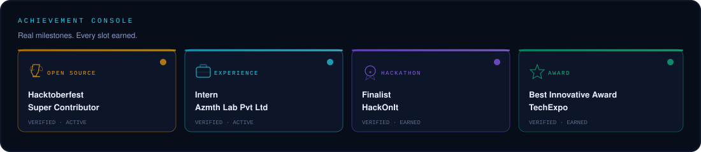

  

  

  
  
  
  
  <!-- EDIT_ME Instagram:  -->
  <!-- EDIT_ME GeeksforGeeks:  -->

<picture>
  <source media="(prefers-color-scheme: light)" srcset="./assets/footer/footer-light.svg" />
  
</picture>

